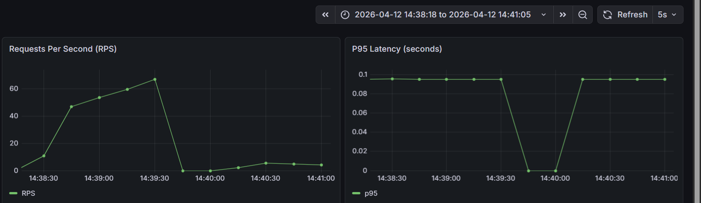
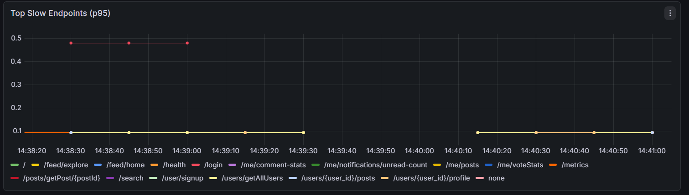

# 📸 Benchmark and Deployed Reality

## ✨ At a Glance

1. deployed screenshots for key Grafana panels,
2. smoke and load test summaries,
3. clear explanation of infra saturation vs code quality.

> **_This file is the benchmark proof for the deployed app_**.

## 🎯 Why This File Exists

I wanted a separate benchmark-proof page so anyone reading the project can quickly understand:

1. what the deployed URL can handle,
2. why load and stress fail on current Azure infra,
3. and why this does not mean the backend code is bad.

## 🌐 Target Used for Deployed Benchmark

- Deployed URL: https://fastapi-social-vm.centralindia.cloudapp.azure.com

## 🖼️ Grafana Panels while Smoke Testing

### 1) Requests Per Second and P95 Latency (Deployed)



Captured on: 2026-04-12 (deployed smoke-test window)

### 2) Top Slow Endpoints (Deployed)



Captured on: 2026-04-12 (deployed smoke-test window)

## ✅ Smoke Test Summary (Deployed, Real Run)

Command used:

```powershell
k6 run loadtests/smoke.js
```

Summary from the deployed run:

1. `http_reqs`: `9321` total (`66.28 req/s`)
2. `http_req_failed`: `2.00%` (`187 out of 9321`)
3. `iterations`: `747`
4. `interrupted iterations`: `97`
5. `p95 latency`: `45.07ms` (threshold `p(95)<1800` passed)
6. endpoint checks: `97.99%` passed (`9134/9321`)

Important context from the same run: repeated transport failures still appeared (`request timeout`, connection attempts failing to respond).

> **Note on variance**: _chart values and summary values can vary slightly between runs, and that is expected_.

## ❌ Load Test Summary (Deployed, Real Run)

1. `http_reqs`: `30475` total (`86.66 req/s`)
2. `http_req_failed`: `33.59%` (`10239 out of 30475`)
3. `iterations`: `2242`
4. `interrupted iterations`: `592`
5. `p95 latency`: `58.91s` (threshold failure)
6. repeated transport errors: `request timeout`, `EOF`, `connection reset`, `connect timeout`

## ⛔ Stress Test Note

No separate stress benchmark is required right now for conclusions.
The load profile is already failing hard on deployed infra, so stress will only amplify the same saturation pattern.


## 🧪 Benchmark Summary (Current)

From the above smoke,load test runs and the above screenshots, the app currently behaves like this on the current Azure setup:

1. smoke traffic can run in a limited band, but already shows transport instability,
2. load and stress profiles degrade heavily,
3. p95 and failure rate rise sharply,
4. transport-level failures appear (`timeout`, `EOF`, connection resets, connection attempts failing).

**This is a loud and clear infrastructure saturation signal, not a "weak code" signal.**
**The backend architecture is async and solid; the current Azure VM/DB sizing is what is being overrun under sustained concurrency.**

## 🧠 Why Deployed Is Currently Limited

If you check [docs/AZURE_DEPLOYMENT.md](./AZURE_DEPLOYMENT.md), the deployed stack is basic-tier and student-budget friendly:

1. VM is a burstable class (`Standard_B2ats_v2`),
2. Postgres is small tier (`B1ms`),
3. Redis runs on same VM and shares resources with app and Nginx.

At high concurrency this causes:

1. CPU/credit pressure on VM,
2. DB IOPS and latency bottlenecks,
3. queueing and timeout amplification at proxy/app layers,
4. internet + TLS overhead that localhost does not have.

So even with Gunicorn + multiple Uvicorn workers, end-to-end throughput can still collapse when infra saturates first.

## ✅ Honest Conclusion

- Current deployed infra is enough to demonstrate real deployment and moderate traffic.
- It is not sized for heavy sustained load/stress profiles.
- **_The async backend architecture is still a solid foundation and is expected to scale much higher on stronger infra tiers and better resource separation._**

