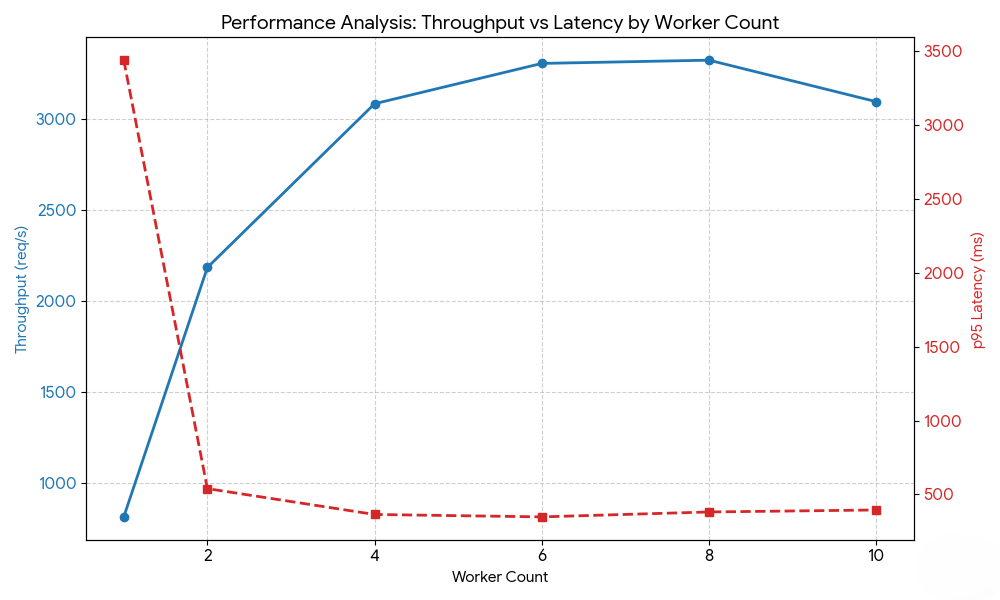

# 📊 App Raw Performance Testing & Monitoring

> Generate realistic load with k6, inspect live traffic in Grafana, and use worker-count testing to find the best performance balance intentionally loadtests are performed on localhost to test the app raw performance.

For deployed app performance, see [`docs/BENCHMARK.md`](./BENCHMARK.md).


The results below were collected on an ASUS VivoBook X1502ZA with a 12th Gen Intel Core i5-1235U (10 physical cores, 12 logical processors). 

**Best Result:** p95 of **347.33ms** with an RPS of **3,306.17 req/s** and **0% failed checks** ✨

For a laptop with a U-series i5 processor, hitting 3,300+ requests per second with p95 under 500ms is not just fine—it's impressive. 💪

**Note:** Results will vary on your machine based on CPU architecture, core count, background processes, and storage speed. However, the **shape of the curve** remains useful for comparing worker counts and identifying optimal code performance.

This guide covers:

1. Setting up Prometheus and Grafana for real-time observability
2. Running k6 load tests against localhost
3. Testing different worker counts to find optimal throughput
4. Understanding what localhost performance tells us about endpoint efficiency

Prometheus and Grafana are already configured in Docker Compose, so no manual setup is required.

### Prerequisites ✅

1. Complete the setup from [`SETUP.md`](./SETUP.md)
2. Verify you're logged into the **Grafana dashboard** (`http://localhost:3000`)
3. Ensure **k6 is installed**, Check this out if not installed [`k6 Installation`](./SETUP.md#install-k6)

### What You'll Mainly Use

- **Grafana** (`http://localhost:3000`): live dashboards and visualization
- **k6** (`installed locally`): load testing framework
- **API** (`http://localhost:8000`): FastAPI application under test
---
- **Prometheus** (`http://localhost:9090`): Query interface for deep-diving into metrics (highly optional now unless you're already familiar with PromQL and wanna see the exxact metrics!)

---

## 🚀 Quick Start

### 1) Start the Services

Before starting the services, know these things:

#### Set BENCHMARK_MODE_ENABLED to true

When `BENCHMARK_MODE_ENABLED=true`, the startup path changes:

1. The Dockerfile entrypoint runs `docker_entrypoint.sh` which reads from `app.config.Settings` and sees `BENCHMARK_MODE_ENABLED=true`.
2. `docker_entrypoint.sh` selects `startup_benchmark.sh`.
3. `startup_benchmark.sh` runs `alembic upgrade head` first.
4. It then starts `gunicorn` with the tuned worker class.
5. `app/main.py` sees benchmark mode is enabled and skips `configure_observability(...)`.
6. FastAPI tracing, SQLAlchemy instrumentation, Prometheus instrumentation, and the request-timing middleware are not added.
7. `startup_benchmark.sh` also sends access logs to `/dev/null`, so only error output remains.

**Bottom line:** When benchmark mode is `true`, observability overhead is stripped to measure raw application throughput accurately with k6.

#### What Worker Count Means

- `GUNICORN_WORKERS` in `.env` sets the number of parallel Uvicorn workers.
- More workers can improve concurrency.
- Too many workers can increase context switching, memory use, and queueing overhead.
- The right value depends on the machine and workload.

#### Test Methodology 🧪

1. Change `GUNICORN_WORKERS` in `.env` (test with: 1, 2, 4, 6, 8, 10 and so on based on your machine Core Count)
2. Restart containers: `docker compose down && docker compose up -d`
3. Run the load test: `k6 run loadtests/load.js`
4. Record the **p95 latency**, **throughput (req/s)**, and **request failure percentage**
5. Repeat for each worker count

Using the same test script (`load.js`) across all runs allows you to identify:
- Where throughput peaks
- When latency starts to degrade
- Signs of machine saturation at higher worker counts

#### Other Gunicorn & Uvicorn Fields ⚙️

These are secondary tuning values already optimized in `.env`. You typically don't need to change them, but you may tune them based on your system:

| Setting | Purpose |
|---------|----------|
| `GUNICORN_TIMEOUT` | Request timeout before worker is recycled |
| `GUNICORN_KEEPALIVE` | How long Gunicorn keeps HTTP connections open for reuse |
| `GUNICORN_BACKLOG` | Pending connection queue size |
| `UVICORN_LOOP` | Async event loop choice for Uvicorn workers |
| `UVICORN_HTTP` | HTTP parser choice for Uvicorn workers |
| `UVICORN_TIMEOUT_KEEP_ALIVE` | Uvicorn keep-alive timeout |


**Now start the services in benchmark mode** 🚀

```powershell
docker compose up -d
```

**Verify all services are running** ✅

```powershell
docker compose ps
```

This will display all running services in Docker Compose.

### 2) Open Monitoring Dashboards

Grafana is best for real-time visual feedback while k6 runs.

Before running k6, open these in separate browser tabs:

**Grafana**
1. Open http://localhost:3000
2. Dashboards → Observability folder → Social API Observability

**Key Panels to Watch**
- Requests per second
- p95 latency
- Top slow endpoints

### 3) Start the k6 Tests 🎬

Focus on [`load.js`](../loadtests/load.js) for comprehensive performance testing. The setup supports `smoke.js` and `stress.js` as well, but the results below are from `load.js` runs.

**Run k6 load test** 📊

```bash:disable-run
k6 run loadtests/load.js
```

**While the test runs:**
- Keep Grafana open in your browser
- Watch panels update in real-time
- Identify bottlenecks and anomalies as virtual users (VU's) increase

---

## 📊 Performance Results On Different Worker Counts

The values below come from the [`load.js`](../loadtests/load.js) k6 runs on the machine described above.

| Worker Count | p95 Latency | Throughput | Failed Requests | Checks | Interpretation |
| --- | --- | --- | --- | --- | --- |
| 1 | 3.44s | 812.55 req/s | 0.00% | 100% | Underpowered. The latency target is missed by a wide margin. |
| 2 | 538.88ms | 2183.95 req/s | 0.00% | 100% | Big improvement in both throughput and latency. |
| 4 | 363.67ms | 3084.44 req/s | 0.00% | 100% | Strong balance of speed and stability. |
| 6 | 347.33ms | 3,306.17 req/s | 0.00% | 100% | ⭐ Best overall balance |
| 8 | 380.67ms | 3,324.03 req/s | 0.00% | 100% | Highest throughput, but diminishing gains |
| 10 | 394.15ms | 3,095.82 req/s | 0.00% | 100% | Efficiency regression 📉 |

### Analysis 🔍

Yes, finding the 'perfect' worker count on your local developer laptop is useless, as it's not the production environment. However, the value isn't the number rather it's about mastering this analysis process. This same methodology is what you will use for your actual cloud-hosted production instances.


**_So Diving into the Performance Analysis, I've generated a dual-axis curve for the above data._**




1. **1 worker is underpowered**. The 3.44s p95 is far outside the target, even though failures stayed at 0%.
2. **2 workers gives the biggest jump**. Latency drops sharply and throughput nearly triples versus 1 worker.
3. **4 and 6 workers are the practical sweet spot**. Throughput keeps climbing, but latency stays low and stable.
4. **8 workers reaches the high-water mark**. It gives the highest throughput, but the gain over 6 workers is small as the latency increased.
5. **10 workers shows regression**. The extra worker pressure starts to hurt both throughput and latency.

For this 10-physical-core CPU, **6 workers** is the optimal choice.

Why not 8?

- 8 workers gives the highest single throughput number, but the latency improvement is not meaningful enough to justify moving away from the more stable 6-worker run.

Why not 10?

- 10 workers is clearly worse than 8.
- The regression suggests the machine is already near the saturation zone.
- Extra workers are now adding scheduling overhead rather than useful work.
---

## 📝 Understanding Localhost Performance

### What Localhost Testing Reveals ✅

- Endpoint bottlenecks
- Database query inefficiencies
- Memory/resource leaks under sustained load
- Worker count vs. throughput tradeoffs

### What It Does NOT Reveal ❌

- Network latency
- Geolocation-specific issues
- Real-world concurrent user behavior at scale
- Production infrastructure bottlenecks (see [`BENCHMARK.md`](./BENCHMARK.md) for deployed app performance)

### Real-World Implications 🌍

> **Localhost performance is the foundation for production readiness.**

- Localhost testing validates application efficiency *before* cloud deployment
- Production numbers are usually lower due to network and infrastructure overhead
- If localhost performance is poor, production will be worse
- Always optimize localhost performance first—it's your early warning system

For production performance of the app on the Azure infrastructure, see [`BENCHMARK.md`](./BENCHMARK.md).